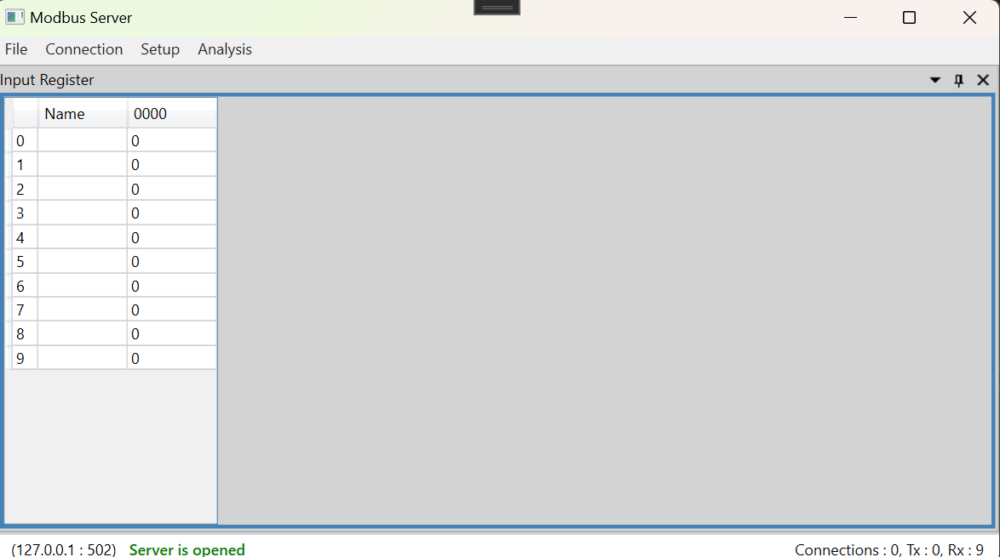
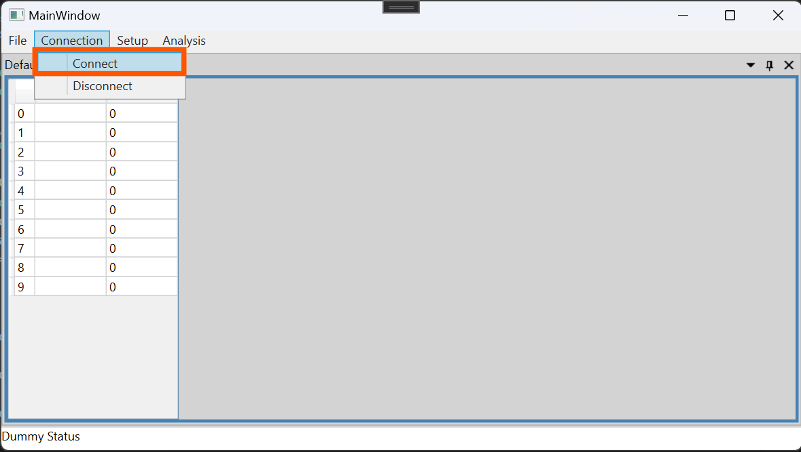
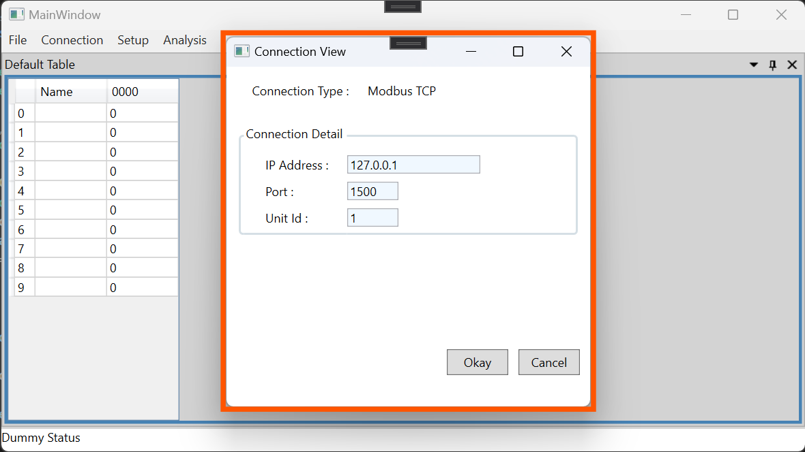
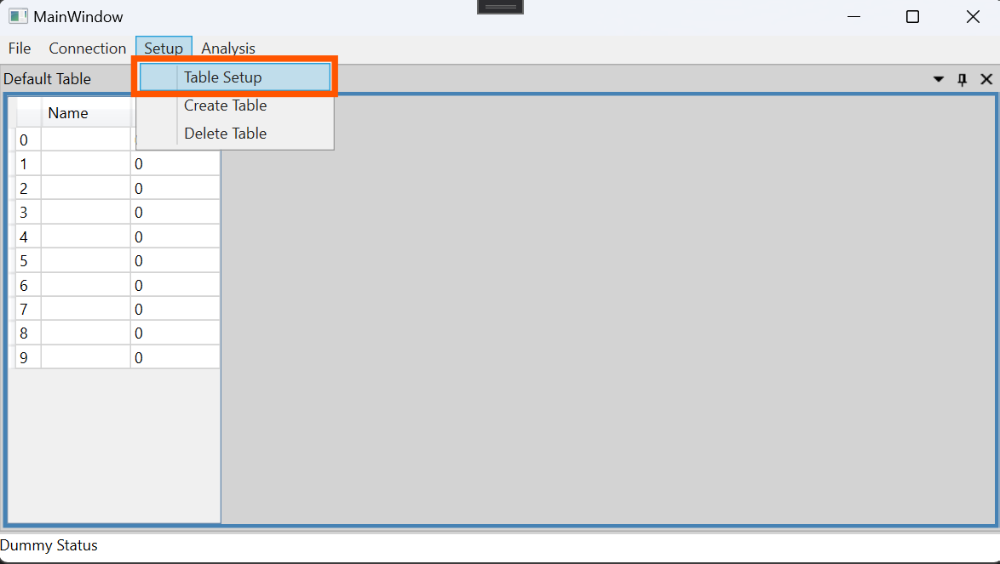
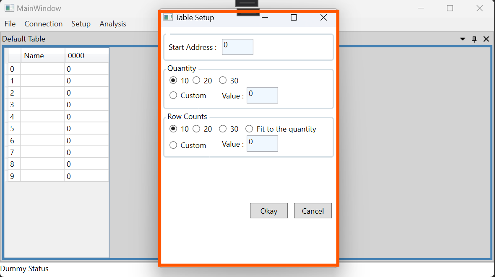
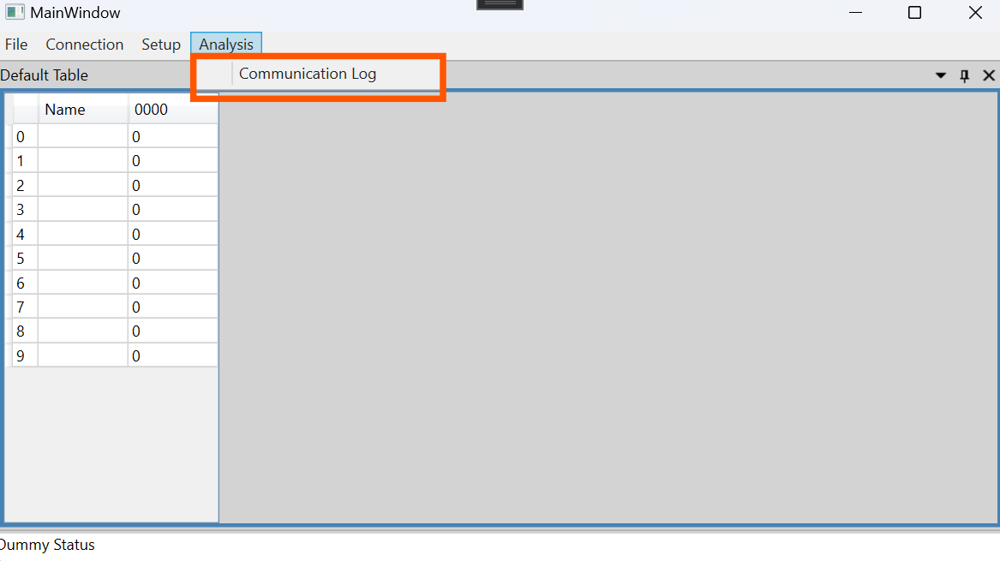
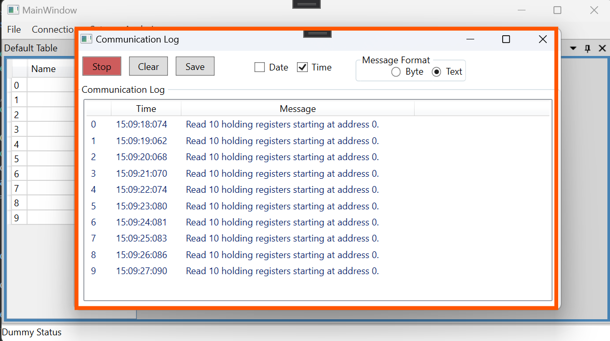

# Modbus Programmes

The programe provides below features. 
- Currently support Mdobus TCP only
- Support Coil Status, Input Status, Holding Register, Input Register
- Provide communication log to trace packets. 

## Modbus Server Guide 
- Connection Popup - You can setup connection defails in connection popup. 
With "Okay" button, modbus server will open. 

- Table Setup Popup - You can adjust "start address", "Quantity", "Row Counts" for your convenience. 

- Communication Log Popup - You can trace and analysis packet logs.

